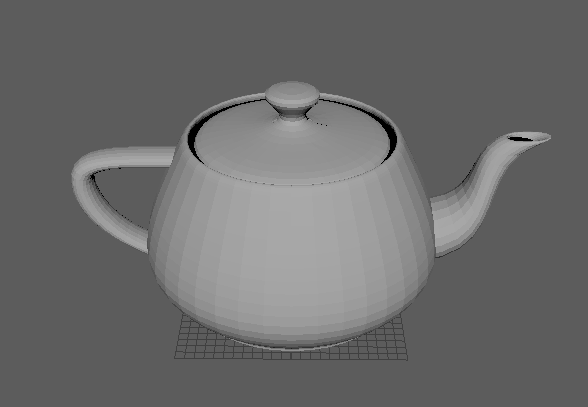
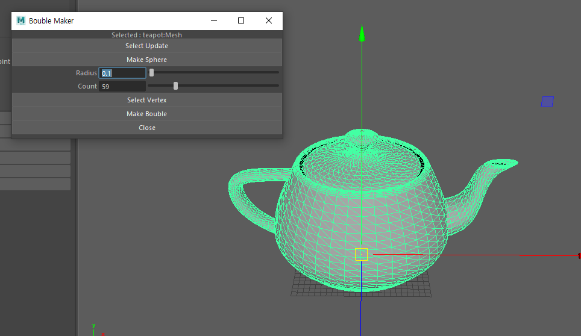
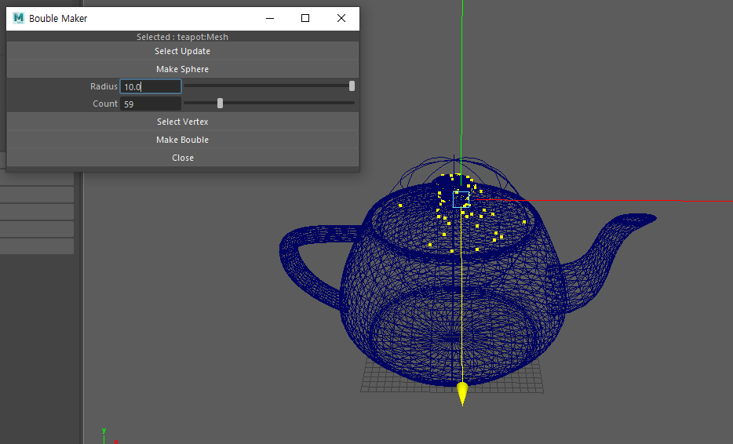
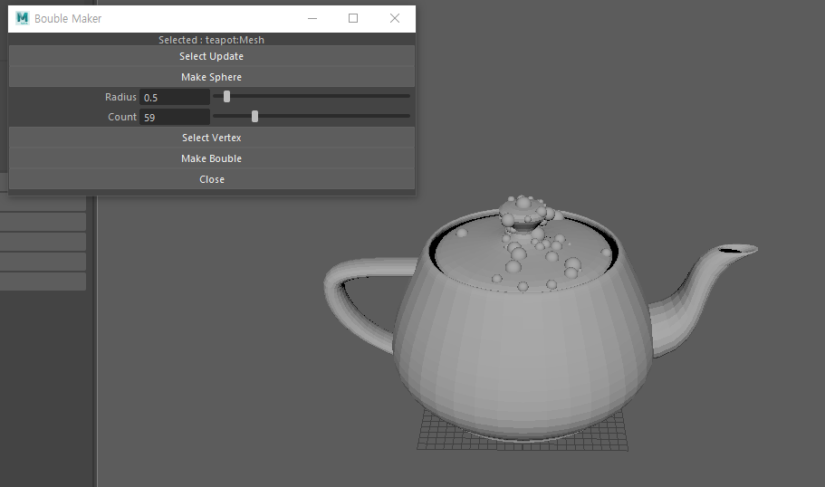

# Instruction for Teapot Bubble Generator usage

## 1. Import teapot.obj or any obj you like.  
For better result, scale the object into 9 times bigger than the original one.      
  
  

## 2. Select Object  
With the window opened, select the object(object mode) in the screen and press "Select Update".     

## 3. Make Nurb sphere
Decide a desired space for bubbles you want to add.     
  

## 4. Select Vertices
This process will randomly select obj vertices, within the nurb sphere.    
  

## 5. Result
 
